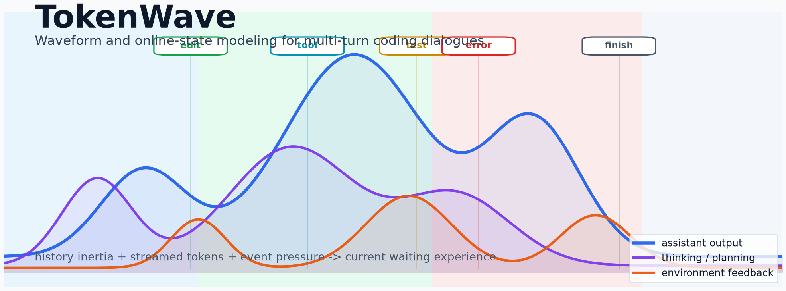
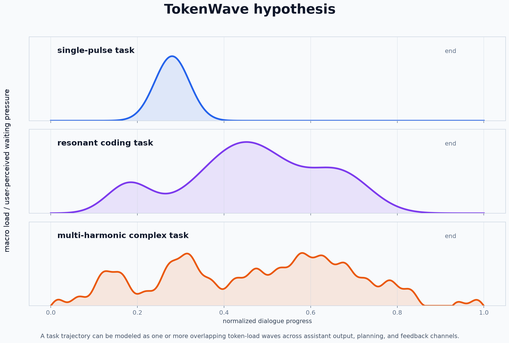
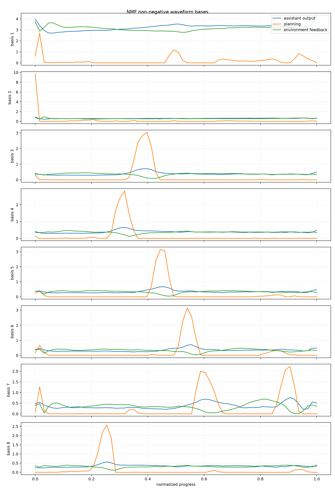
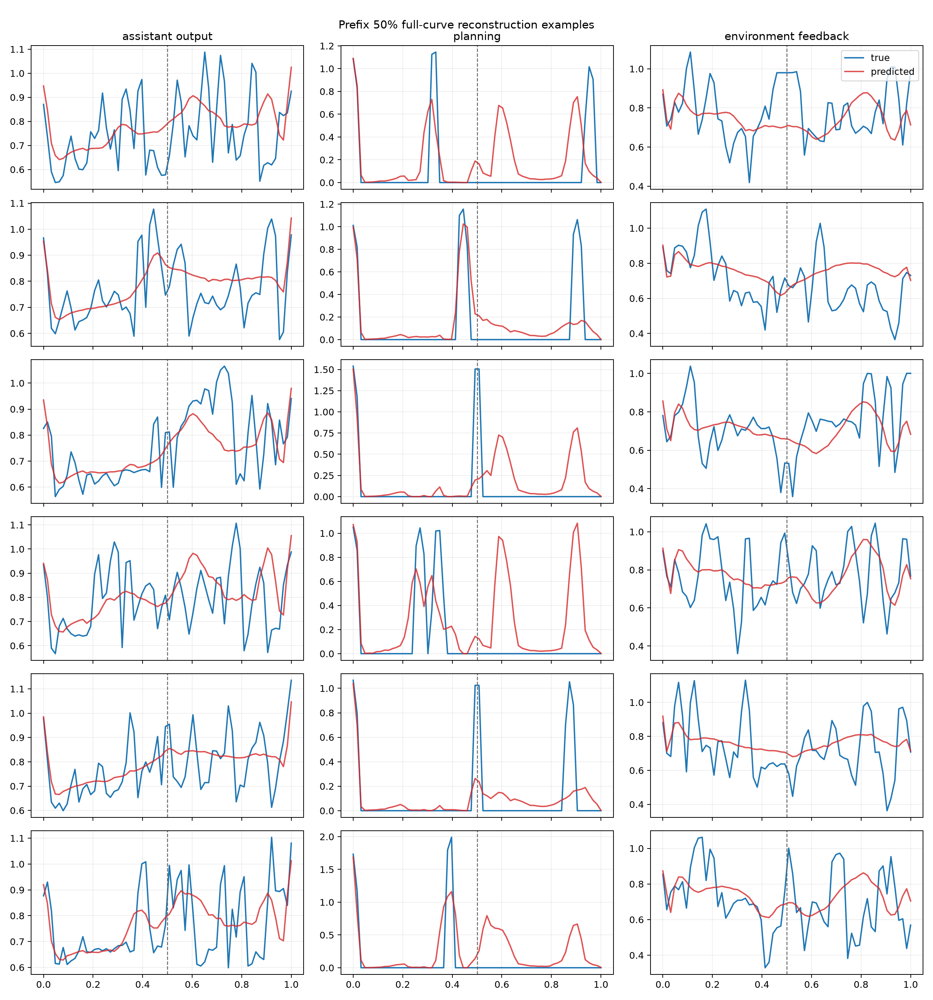
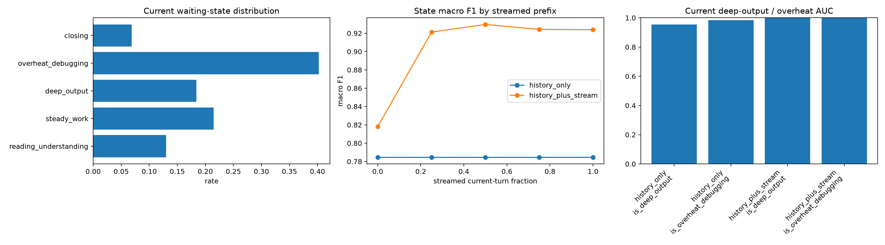

# TokenWave



TokenWave 是一个关于多轮 LLM 编码任务的探索性研究项目。核心问题是：能否把一段任务对话看成多通道 token 时间序列，并用波形基、前缀预测和在线状态特征来估计对话进度与用户可感知的等待体验。

本仓库整理的是科研实验本身，不是 Codex 桌宠插件仓库。桌宠只是一个应用场景，相关接口草案放在 `docs/application/`。

## Research Question

研究假说：

1. 一个任务的多轮对话可以抽象为波形：用户问题、模型输出、思考规划、环境反馈和工具事件会随任务推进形成负载变化。
2. 简单任务更像单个脉冲；复杂任务更像多个波形基或谐波叠加。
3. 对话状态不一定是规则单峰，但可以通过多通道时间序列、非负波形基和在线特征捕捉。
4. 对桌宠等实时应用来说，最有用的目标不是精确剩余轮数，而是当前等待体验：当前是否长输出、是否红温调试、是否稳定推进、是否收束。



## Data

实验基于 CoderForge Preview 的 tokenized coding trajectories：

```text
ModelScope: togethercomputer/CoderForge-Preview
subset/path: trajectories-tokenized_qwencoder
```

本仓库不提交原始数据和全量中间 parquet。原因是：

- 原始数据需要单独下载。
- 全量 `turn_timeseries.parquet` 接近 GB 级。
- GitHub 更适合保存脚本、文档、轻量指标和关键图表。

数据下载与服务器运行流程见：

- [docs/experiments/00_data_pipeline.md](docs/experiments/00_data_pipeline.md)
- [docs/experiments/01_turn_timeseries_extraction.md](docs/experiments/01_turn_timeseries_extraction.md)

## Main Signals

实验最终把主波形信号收敛为三条：

| 中文名 | 字段 | 含义 |
|---|---|---|
| 模型输出长度 | `assistant_tokens` | assistant 当前回合输出 token 数 |
| 思考规划长度 | `thinking_tokens_est` | 规划/推理相关文本长度估计 |
| 环境反馈长度 | `user_tokens_est` | 用户消息、工具返回、报错上下文长度估计 |

事件只作为标记或增强特征：

| 中文名 | 字段 |
|---|---|
| 编辑事件 | `edit_count` |
| 测试事件 | `test_count` |
| 错误反馈事件 | `error_feedback_count` |
| 结束事件 | `finish_call_count` |

## Experiment Stages

| 阶段 | 文档 | 脚本 | 轻量结果 |
|---|---|---|---|
| 数据下载与全量流水线 | [00_data_pipeline](docs/experiments/00_data_pipeline.md) | [run_coderforge_pipeline.sh](scripts/run_coderforge_pipeline.sh) | 本地 `outputs/coderforge_full/` |
| 逐轮时间序列抽取 | [01_turn_timeseries_extraction](docs/experiments/01_turn_timeseries_extraction.md) | [extract_turn_timeseries.py](scripts/extract_turn_timeseries.py), [build_full_timeseries.py](scripts/build_full_timeseries.py) | 本地 `outputs/coderforge_full/` |
| NMF 波形基学习 | [02_waveform_basis](docs/experiments/02_waveform_basis.md) | [waveform_basis_experiment.py](scripts/waveform_basis_experiment.py) | [results/waveform_basis_experiment](results/waveform_basis_experiment) |
| 在线对话状态预测 | [03_online_dialogue_state_prediction](docs/experiments/03_online_dialogue_state_prediction.md) | [pet_state_experiment.py](scripts/pet_state_experiment.py) | [results/pet_state_experiment](results/pet_state_experiment) |
| 前缀续写与机器学习增强 | [04_prefix_continuation_and_ml](docs/experiments/04_prefix_continuation_and_ml.md) | [prefix_pet_target_experiment.py](scripts/prefix_pet_target_experiment.py) | [results/prefix_pet_target_experiment](results/prefix_pet_target_experiment) |
| 当前等待体验实验 | [05_current_waiting_experience](docs/experiments/05_current_waiting_experience.md) | [current_waiting_experience_experiment.py](scripts/current_waiting_experience_experiment.py) | [results/current_waiting_experience_experiment](results/current_waiting_experience_experiment) |

## Key Results

### Visual overview

#### Learned waveform bases

NMF 从三条主信号中学到若干非负波形基，用来描述不同任务轨迹中的负载形态。



#### Prefix reconstruction examples

只给定 50% 前缀时，波形基可以做形态解释和弱预警，但还不足以可靠续写完整未来曲线。



#### Current waiting-experience state prediction

最新实验显示，当前状态估计应依赖“历史统计惯性 + 当前流式即时特征”。只看历史统计已经可用，加入当前 token 前缀后明显提升。



### 1. Pure waveform continuation is weak as a standalone predictor

NMF 波形基可以解释一部分轨迹形态，但“只用前缀拟合波形基再续写完整未来曲线”没有打过平均模板。它更适合作为形态解释和弱预警特征，而不是独立预测器。

见：

- [docs/experiments/02_waveform_basis.md](docs/experiments/02_waveform_basis.md)
- [docs/experiments/04_prefix_continuation_and_ml.md](docs/experiments/04_prefix_continuation_and_ml.md)

### 2. Online statistical features are strong for dialogue state

在在线前缀样本上，近期错误、测试、输出峰值、累计环境反馈、当前轮序号等特征能够稳定识别对话状态。

早期实验中，5 状态分类宏平均 F1 约 `0.923`，但该标签是启发式标签，不是人工标注。

见：

- [docs/experiments/03_online_dialogue_state_prediction.md](docs/experiments/03_online_dialogue_state_prediction.md)

### 3. The best product target is current waiting experience

最新实验把目标从“未来 3/5 轮”拉近到“当前正在输出的这一轮”，模拟当前 turn 的 `0% / 25% / 50% / 75% / 100%` 流式前缀。

正式结果：

| 输入信息 | 当前状态 accuracy | 当前状态宏平均 F1 |
|---|---:|---:|
| 规则状态机 | 0.689 | 0.547 |
| 只看历史统计 | 0.828 | 0.785 |
| 历史统计 + 当前流式前缀 | 0.937 | 0.904 |

按当前轮已流出比例：

| 当前轮已流出比例 | 宏平均 F1 |
|---:|---:|
| 0% | 0.818 |
| 25% | 0.921 |
| 50% | 0.930 |
| 75% | 0.924 |
| 100% | 0.924 |

结论：对实时应用来说，状态估计应使用“历史统计惯性 + 当前流式即时特征”，而不是长窗口未来预测。

见：

- [docs/experiments/05_current_waiting_experience.md](docs/experiments/05_current_waiting_experience.md)
- [results/current_waiting_experience_experiment/current_waiting_experience_metrics.csv](results/current_waiting_experience_experiment/current_waiting_experience_metrics.csv)

完整轻量结果索引见：

- [docs/results_index.md](docs/results_index.md)

## Application Draft

Codex 事件到桌宠状态的接口草案放在：

- [docs/application/codex_pet_state_interface_draft.md](docs/application/codex_pet_state_interface_draft.md)

它定义了：

- 输入事件
- 在线特征
- 5 个状态
- 状态优先级
- 状态平滑规则
- 输出 JSON

该文档是研究结果的应用转译，不是本仓库的主实验目标。

## Quick Start

安装依赖：

```bash
python -m venv .venv
source .venv/bin/activate
pip install -r requirements.txt
```

下载全量数据并运行流水线：

```bash
nohup ./scripts/run_coderforge_pipeline.sh > coderforge_pipeline.log 2>&1 &
```

单独运行当前等待体验实验：

```bash
python scripts/current_waiting_experience_experiment.py \
  --input outputs/coderforge_full/turn_timeseries.parquet \
  --out-dir outputs/current_waiting_experience_experiment \
  --max-trajectories 30000 \
  --max-examples 180000
```

## Repository Layout

```text
.
├── docs/
│   ├── experiments/       # 每个阶段的实验方案、结果和限制
│   └── application/       # 应用草案，不是主仓库目标
├── assets/                # README 头图和研究假说图
├── results/               # 轻量结果快照：CSV/JSON/PNG/报告
├── scripts/               # 数据处理与实验脚本
├── requirements.txt
└── README.md
```

本地运行会生成：

```text
data/
outputs/
.venv/
.matplotlib/
```

这些目录默认不提交。

## GitHub Upload

手动建仓和上传步骤见：

- [docs/github_setup.md](docs/github_setup.md)

## Limitations

1. 当前标签均为启发式标签，不是人工标注。
2. CoderForge 没有真实流式时间戳，当前等待体验实验使用 token 前缀模拟。
3. `thinking_tokens_est` 和 `user_tokens_est` 是估计值。
4. CoderForge 编码轨迹不完全等同于真实 Codex 桌面日志。
5. 波形基更适合作为解释和辅助特征，目前不适合作为独立未来曲线预测器。

## Recommended Citation

如果复用本仓库，建议引用为：

```text
TokenWave: waveform and online-state modeling for multi-turn coding dialogues.
```
